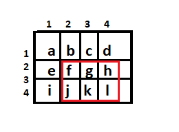

# 2D Binary Indexed Tree / 2D Fenwick Tree

## Introduction
**Binary Indexed Tree/BIT** was first proposed by [Peter M. Fenwick](http://citeseerx.ist.psu.edu/viewdoc/download?doi=10.1.1.14.8917&rep=rep1&type=pdf).
It was first used for data compression. In competitive programming, it is often used for storing frequencies and manipulating cumulative frequency tables.
Binary Indexed Tree can be generalized into mutiple dimensions. So, **2D-Binary Indexed Tree** was proposed by [Pushkar Mishra](https://arxiv.org/pdf/1311.6093.pdf).
2D-BIT is nothing but an array of 1D-BIT. It is basically used to solve the problem of updating and querying sub-arrays of two-dimensional arrays. 
The idea and working of 2D-BIT is same as 1D-BIT but you work with x and y co-ordinates. You can read more from [this](https://www.topcoder.com/community/competitive-programming/tutorials/binary-indexed-trees/) article. Presentation slides are also available [here](./pptSlides.pdf).

## Working
2D-BIT is just a BIT of mutiple BITs. It works same as 1D-BIT but you work in two dimensions so, you have two loops for each co-ordinate.
Let's see an example.

<!--Matrix Pic-->

Consider a matrix of size 3x4 as given above. We want to find **Sum** of sub-matrix ((2,2), (3,4)) highlighted in red box. First, we calculate the sum from origin to the upmost point. Then, using [inclusion-exclusion principle](https://en.wikipedia.org/wiki/Inclusion%E2%80%93exclusion_principle), we exclude the sum of extra parts of matrix. Idea of calculating sum is same as 1D-BIT. For example, we accumulate sum in a variable and subtract 1 bit from given position and descend the array. **Update** is also same as 1D-BIT like we add 1 bit to given position and climb up the array. The only change is that we do this work in both responsible rows and columns.

## Complexity
- Update : O(logMN) (Where M and N are size of matrix)
- Query : O(logMN) 

## Conclusion
- BITs are very easy to code.
- Each query on BITs takes constant or logarithmic time.
- You can use it as an n-dimensional data structure.
- 2D BITs are used for sub-matrix queries.
